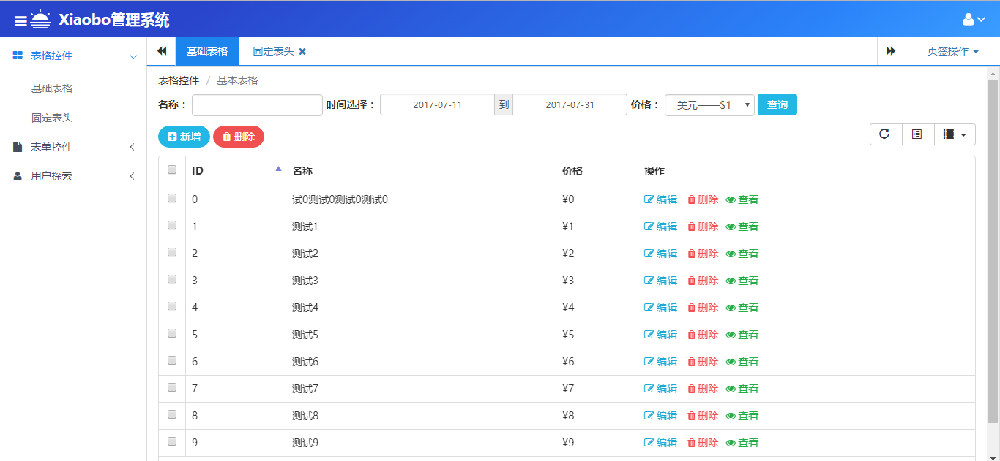

## 启动页面
>index.html

本后台管理系统基础模板是基于iframe刷新主内容区的，它收集了常用的jquery插件，它可直接用于基于jquery的后台管理系统的开发。

## 插件汇总
<ol>
<li>bootstrap整体UI库：http://v3.bootcss.com/</li>
<li>animate.css动画库：http://www.dowebok.com/demo/2014/98/</li>
<li>font-awesome字体库：http://fontawesome.dashgame.com/</li>
<li>nprogress进度条插件：http://ricostacruz.com/nprogress/</li>
<li>metisMenu左侧导航栏：http://mm.onokumus.com/</li>
<li>表格插件bootstrap-table：http://bootstrap-table.wenzhixin.net.cn/zh-cn/</li>
<li>消息提示toastr：http://blog.csdn.net/cyh1111/article/details/53141037</li>
<li>日期控件bootstrap-datepicker：https://github.com/uxsolutions/bootstrap-datepicker</li>
<li>上传附件bootstrap-fileinput：http://www.cnblogs.com/landeanfen/p/5007400.html</li>
<li>树控件jsTree:https://www.jstree.com/api/</li>
<li>loading页面加载插件：自己封装</li>
<li>tab切换：自己封装</li>
</ol>